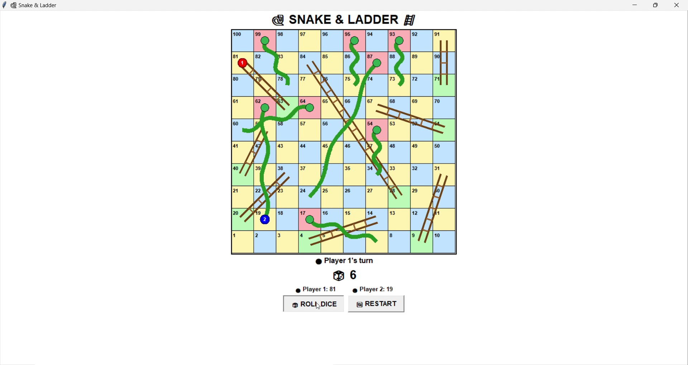
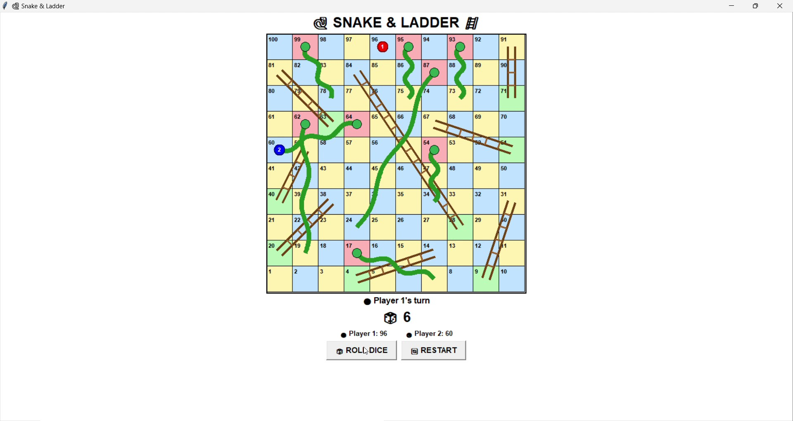

# Python Games Collection

Welcome to my Python Games Collection!

This repository contains two Python games developed using Python.

---

## Games

### 1. Snake & Ladder

A two-player graphical Snake & Ladder game developed using Python and Tkinter.

### Features

* Two-player gameplay
* Snakes
* Ladders
* Animated dice
* Winner detection
* Restart button
* 10 x 10 graphical board

### Technology

* Python 3.13
* Tkinter
* Random
* Math

### Run the Game

```bash
python gui_game.py
```

---

### 2. SpaceDodge

SpaceDodge is a space-themed game developed using Python and Pygame.

### Features

* Space-themed gameplay
* Keyboard controls
* Dodge obstacles
* Collision detection
* Score system
* Interactive gameplay

### Technology

* Python 3.13
* Pygame

### Run the Game

Install Pygame:

```bash
py -3.13 -m pip install pygame
```

Run SpaceDodge:

```bash
py -3.13 SpaceDodge/game.py
```

---

## Requirements

* Python 3.13
* Tkinter
* Pygame

---

## Controls

### Snake & Ladder

* Click **Roll Dice** to roll the dice.
* The player moves according to the dice result.
* Landing on a ladder moves the player upward.
* Landing on a snake moves the player downward.
* The first player to reach 100 wins.
* Use the **Restart** button to start a new game.

### SpaceDodge

* Use the keyboard to control the spaceship.
* Move the spaceship to avoid obstacles.
* Avoid collisions.
* Try to achieve the highest score.

---

## Project Structure

```text
Snake-and-ladder/
│
├── gui_game.py
│
├── SpaceDodge/
│   └── game.py
│
├── screenshots/
│   ├── snake-ladder-1.jpg
│   └── snake-ladder-2.jpg
│
└── README.md
```

---

## About

This repository contains my Python game development projects.

### Games Included

1. Snake & Ladder
2. SpaceDodge

---

## Author

**BR SHARMILA**

CSE Student
UBDT College of Engineering

---

## 📸 Screenshots

### 🐍 Snake & Ladder




